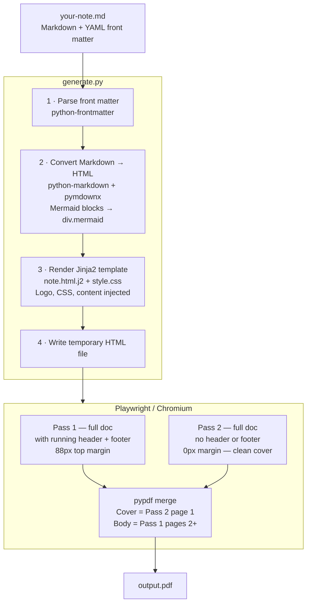
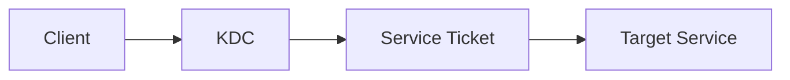
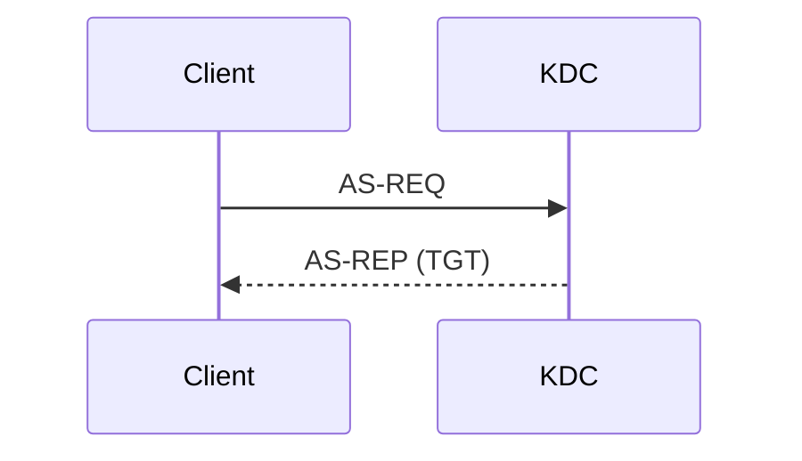

# GhostSheet
GhostSheet is an in-house markdown-to-PDF tool for producing clean PDF cheatsheets and technical notes - mainly used for easy clean access during exam scenarios.

## Features

- **Markdown-first** — write in plain `.md` files with YAML front matter for metadata
- **Dark theme** — deep navy background, Atlas syntax highlighting, styled admonition boxes
- **Mermaid diagrams** — flowcharts, sequence diagrams, and more can render directly in the PDF
- **Two-column layout** — optional via a single front matter flag
- **Auto cover page** — logo, category tag, title, subtitle, and metadata row generated automatically
- **Running header/footer** — logo top-right, red separator line, author/title/category in footer
- **Clean cover** — two-pass PDF generation ensures the cover page has no header or footer overlay

## Architecture



The two-pass approach is essential for the cover page — Playwright by default has no mechanism to suppress its header on individual pages via CSS alone, so a second headerless render is produced and the pages are merged with `pypdf`.

## Installation

**Requirements:** Python 3.10+

```bash
pip install -r requirements.txt
playwright install chromium
```

`requirements.txt`:
```
jinja2>=3.1.0
playwright>=1.40.0
pypdf>=4.0.0
markdown>=3.5.0
pygments>=2.17.0
pymdown-extensions>=10.0
python-frontmatter>=1.1.0
```

> **Note:** Mermaid diagram rendering requires an internet connection at generation time (loads Mermaid.js from jsDelivr CDN). All other features work fully offline.

---

## Quick Start

```bash
# Generate a PDF from a Markdown file
python generate.py my-note.md

# Specify output path
python generate.py my-note.md --output AD-Cheatsheet.pdf

# Preview as HTML in your browser before generating
python generate.py my-note.md --html --open

# Generate and open the PDF immediately
python generate.py my-note.md --open
```

## Front Matter Reference

Every note starts with a YAML front matter block between `---` delimiters:

```yaml
---
title: "Active Directory Attacks"
subtitle: "Techniques, Tools & Detection"
category: "Red Team"
author: "RootSec"
date: "2026-04-02"
version: "1.2"
logo: ""          # optional: relative path to a logo image (defaults to logo.png)
two_column: false # optional: enable two-column layout for the content pages
---
```

| Field | Required | Default | Description |
|---|---|---|---|
| `title` | No | Filename (title-cased) | Main heading on the cover page |
| `subtitle` | No | *(empty)* | Secondary line below the title |
| `category` | No | `Notes` | Shown on cover, footer, and header |
| `author` | No | `RootSec` | Shown on cover and in footer |
| `date` | No | Today's date | Used internally; not shown on cover |
| `version` | No | `1.0` | Shown on cover as `v1.0` |
| `logo` | No | `logo.png` in script dir | Path to logo image, relative to the `.md` file |
| `two_column` | No | `false` | Splits content into two columns |

## Markdown Features

### Headings & Structure

```markdown
# Top-level heading      — large, white, full-width underline
## Section heading        — red accent bar, uppercase treatment
### Sub-section           — muted grey, smaller
#### Minor heading        — tiny, uppercase, letter-spaced
```

The table of contents is generated automatically from `##` and `###` headings and appears as its own page after the cover.

### Code Blocks

Fenced code blocks with a language tag get full syntax highlighting using a custom theme:

````markdown
```bash
sudo nmap -sV -p 443 10.0.0.1
```

```python
import requests
r = requests.get("https://example.com")
print(r.status_code)
```

```powershell
Get-ADUser -Filter * | Select-Object Name, SamAccountName
```
````

Supported languages include `bash`, `python`, `powershell`, `go`, `javascript`, `sql`, `yaml`, and [any language Pygments supports](https://pygments.org/languages/).

**Atlas syntax theme colour reference:**

| Token | Colour | Examples |
|---|---|---|
| Keywords | `#9575c4` purple | `if`, `for`, `import`, `function` |
| Strings | `#50b88a` green | `"hello"`, `'world'` |
| Numbers | `#c98044` orange | `42`, `3.14`, `0xff` |
| Functions | `#5b8fd9` blue | `print()`, `Get-Item` |
| Comments | `#75869f` grey italic | `# comment`, `// note` |
| Operators/punctuation | `#52b4b4` cyan | `=`, `+`, `{`, `}` |
| Built-ins | `#50b88a` green | `len`, `range`, `True` |
| Tags | `#cb6055` red | `<div>`, `<script>` |

---

### Mermaid Diagrams

Any fenced block with the language tag `mermaid` is rendered as a diagram:

````markdown

```


````

Flowcharts, sequence diagrams, graph diagrams, and all standard Mermaid diagram types are supported. Diagrams render with the Atlas dark theme (navy backgrounds, cyan lines, light grey text).

### Admonition Boxes

Callout boxes for tips, warnings, and alerts:

```markdown
!!! note "Tip"
    Use `-c DCOnly` for stealthy BloodHound collection.

!!! warning "Lockout Risk"
    Check the domain lockout policy before spraying.

!!! danger "Impact"
    DCSync dumps the krbtgt hash — treat as full domain compromise.

!!! tip "Detection"
    Monitor Event ID 4769 for RC4 encryption type requests.
```

Available types: `note`, `tip`, `warning`, `danger`, `attention`, `important`

### Tables

Standard GFM table syntax:

```markdown
| Hash Type | Mode | Example |
|---|---|---|
| NTLMv2 | `-m 5600` | `hashcat -m 5600 hashes.txt rockyou.txt` |
| Kerberos TGS | `-m 13100` | `hashcat -m 13100 tgs.txt rockyou.txt` |
```

### Other Elements

```markdown
> Blockquote — rendered with a red left border

- [ ] Task list item (unchecked)
- [x] Task list item (checked)

**Bold text** — white, weight 600
*Italic text* — muted grey
`inline code` — blue tint, blue border
```

## Customising the Template

The visual output is controlled by two files:

```
notes-template/
└── template/
    ├── note.html.j2      ← page structure (Jinja2 template)
    └── assets/
        └── style.css     ← all visual styling
```

### How Jinja2 Templates Work

Jinja2 templates are HTML files with embedded logic. `generate.py` renders `note.html.j2` by passing a set of Python variables into it. The template uses those variables to build the final HTML page.

**Syntax at a glance:**

| Syntax | Purpose | Example |
|---|---|---|
| `{{ variable }}` | Output a variable | `{{ meta.title }}` |
| `{{ variable \| filter }}` | Apply a filter | `{{ content_html \| safe }}` |
| `...` | Conditional block | `` |
| `...` | Loop | `` |
| `{# comment #}` | Template comment | `{# not rendered #}` |

The `| safe` filter tells Jinja2 not to escape HTML — required for any variable that already contains rendered HTML (like `content_html` and `toc_html`).

### Variables Available in `note.html.j2`

These are passed by `generate.py` and available anywhere in the template:

| Variable | Type | Contents |
|---|---|---|
| `meta` | dict | All front matter fields (`meta.title`, `meta.author`, `meta.category`, etc.) |
| `content_html` | string | The full Markdown body rendered as HTML |
| `toc_html` | string | Table of contents HTML generated from headings |
| `logo_data` | string | Base64 data URI of the logo image |
| `css_content` | string | Full contents of `style.css`, inlined into `<style>` |
| `generation_date` | string | Today's date formatted as `April 05, 2026` |

### Adding a New Section to the Cover Page

The cover page is the first `<div>` in `note.html.j2`. To add a new field — for example a `classification` label — you would:

**1. Add the field to your front matter:**
```yaml
classification: "INTERNAL"
```

**2. Add a fallback default in `generate.py`** (inside `main()`):
```python
meta.setdefault("classification", "")
```

**3. Add the element to the template** in the cover `<div>`:
```html

<div class="notes-classification">{{ meta.classification }}</div>

```

**4. Style it in `style.css`:**
```css
.notes-classification {
  font-size: 9px;
  font-weight: 700;
  letter-spacing: 0.14em;
  text-transform: uppercase;
  color: var(--accent);
  margin-bottom: 12px;
}
```

### Adding a New Content Page / Section

To insert a new full page (e.g. a "References" page between the TOC and content):

**1. Add your HTML to `note.html.j2`** between the TOC and content divs:

```html
{# ── REFERENCES PAGE ──────────────────────────────────── #}
<div class="references-page page-break">
  <h2>External References</h2>
  <p>{{ meta.references_note | default('') }}</p>
</div>
```

The `page-break` class (already defined in `style.css`) forces this element to start on a new page.

## CSS Design Tokens

All colours are defined as CSS custom properties at the top of `style.css`. Change these variables and every element that uses them updates automatically — you never need to hunt through individual selectors.

```css
:root {
  /* Backgrounds */
  --bg-page:       #0a0e14;   /* page background */
  --bg-primary:    #0d1117;   /* base surface */
  --bg-secondary:  #161b22;   /* raised surface */
  --bg-card:       #1c2128;   /* card / panel */
  --bg-code:       #101319;   /* code block background (Atlas) */

  /* Text */
  --text-primary:  #f0f6fc;   /* headings, strong */
  --text-secondary:#8b949e;   /* body text */
  --text-muted:    #484f58;   /* labels, placeholders */

  /* Accent */
  --accent:        #e63946;   /* red — cover, h2 bars, admonition borders */
  --accent-dim:    #c1121f;   /* darker red for gradients */

  /* Borders */
  --border:        #30363d;
  --border-light:  #21262d;

  /* Typography */
  --font-sans: 'Inter', 'Segoe UI', system-ui, sans-serif;
  --font-mono: 'JetBrains Mono', 'Fira Code', 'Consolas', monospace;

  /* Admonition box colours */
  --note-border:   #2196f3;
  --tip-border:    #4caf50;
  --warn-border:   #f5c518;
  --danger-border: #e63946;
}
```

### Common Customisations

**Change the accent colour** (e.g. blue instead of red):
```css
--accent:     #1a7dd9;
--accent-dim: #1060b0;
```

**Change the page background** (e.g. slightly lighter):
```css
--bg-page: #0d1117;
```

**Change the body font:**
```css
--font-sans: 'IBM Plex Sans', sans-serif;
```
Then add the corresponding `@import` at the top of `style.css`.

## File Reference

```
notes-template/
├── generate.py              ← CLI entry point — run this
├── logo.png                 ← default logo (auto-loaded if no logo: set in front matter)
├── example-note.md          ← sample note demonstrating all features
└── template/
    ├── note.html.j2         ← Jinja2 template — cover, TOC, content structure
    └── assets/
        └── style.css        ← all CSS — design tokens, typography, code, admonitions
```
